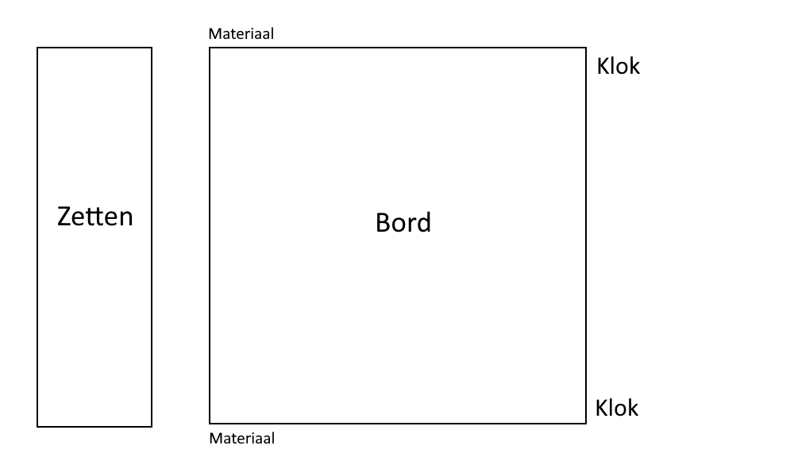

# U staat schaak
Het PWS van Jens Boomgaard, Sebastiaan van Straten en Patrick Vreeburg.

# Plannen
### Basisversie
Stukken definieren in aparte .py file
Multidimensional array met lijsten per rank
Bitboards per soort stuk per kleur

Indeling basisapp:
